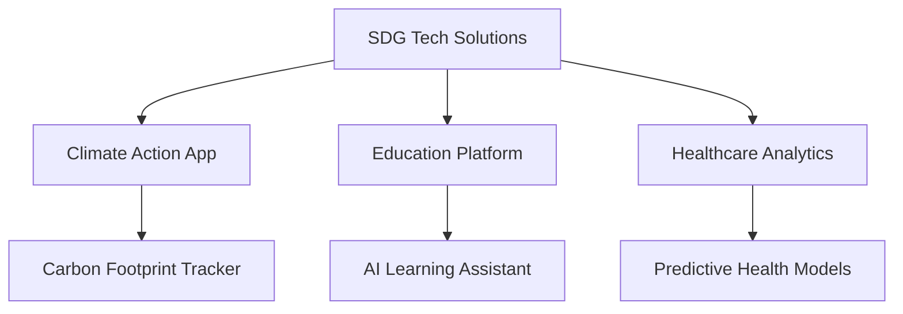
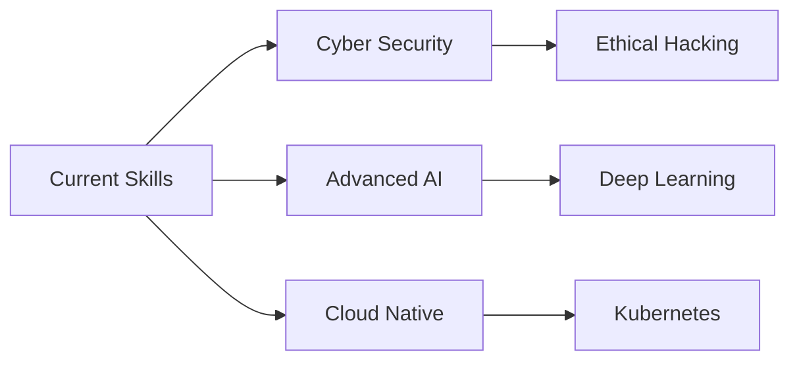
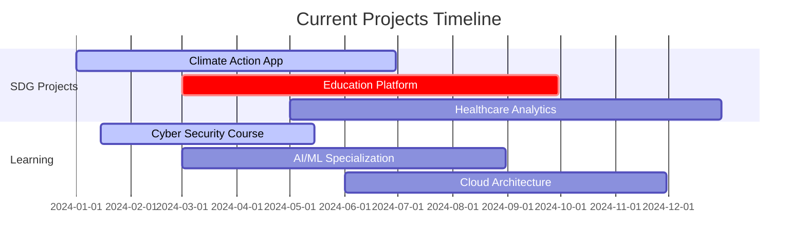

Here's an ultra-advanced GitHub profile with cutting-edge features:

```
<div align="center">
  
</div>

<div align="center">
  


</div>

<!-- Animated Matrix Background -->
<div align="center">
  
</div>

<!-- Interactive Profile Views & Stats -->
<div align="center">
  
[](https://github.com/sidd07-hub)
[](https://github.com/sidd07-hub?tab=followers)
[](https://github.com/sidd07-hub?tab=repositories)
[](https://github.com/sidd07-hub)
[](https://github.com/sidd07-hub?tab=repositories)
[](https://github.com/sidd07-hub)

</div>

<!-- Dynamic Clock -->
<div align="center">
  
</div>

---

## 🎯 Digital Identity Matrix

<div align="center">

```yaml
apiVersion: developer/v2024
kind: Profile
metadata:
  name: siddhesh-nikumb
  namespace: tech-innovator
spec:
  personal:
    location: "Maharashtra, India 🇮🇳"
    timezone: "UTC+5:30"
    languages: ["English", "Hindi", "Marathi"]
    motto: "Code with Purpose, Build with Impact"
  
  expertise:
    primary: ["Frontend Development", "Cloud Architecture", "AI/ML"]
    secondary: ["DevOps", "Mobile Development", "IoT"]
    emerging: ["Quantum Computing", "Blockchain", "AR/VR"]
  
  mission:
    focus: "Sustainable Development Goals through Technology"
    vision: "Building tomorrow's solutions today"
    impact: "Creating tech that matters for humanity"
```

</div>

---

## 🚀 Current Missions & Objectives

<div align="center">

<table>
<tr>
<td align="center" width="50%">

### 🎯 Active Projects


</td>
<td align="center" width="50%">

### 📚 Learning Journey


</td>
</tr>
</table>

</div>

---

## 🛠️ Technology Arsenal & Expertise Matrix

<div align="center">

### 🌟 Expert Level (90-100%)
       

### 🔥 Advanced Level (70-89%)
       

### ⚡ Intermediate Level (50-69%)
       

### 🌱 Learning & Exploring
       

</div>

---

## 📊 Advanced GitHub Analytics Dashboard

<div align="center">

### 🔥 Performance Metrics


</div>

<div align="center">

### 🌟 Contribution Patterns


</div>

<div align="center">

### 📈 Activity Graph


</div>

<div align="center">

### 🏆 Achievement Gallery


</div>

---

## 🎮 Coding Activity & Productivity

<div align="center">

### ⏰ WakaTime Stats
<!--START_SECTION:waka-->
```text
Python       8 hrs 45 mins   ████████████░░░░░░░░░░░░░   48.2%
JavaScript   4 hrs 12 mins   ████████░░░░░░░░░░░░░░░░░   23.1%
TypeScript   2 hrs 30 mins   ███░░░░░░░░░░░░░░░░░░░░░░   13.8%
CSS          1 hr 15 mins    ██░░░░░░░░░░░░░░░░░░░░░░░   6.9%
HTML         45 mins         ██░░░░░░░░░░░░░░░░░░░░░░░   4.2%
Others       42 mins         █░░░░░░░░░░░░░░░░░░░░░░░░   3.8%
```
<!--END_SECTION:waka-->

### 📅 Contribution Calendar 3D


</div>

---

## 🌐 Connect & Collaborate Hub

<div align="center">

### 🤝 Professional Network
[](https://www.linkedin.com/in/siddhesh-nikumb-7884392b2/)
[](mailto:siddheshnikumb@gmail.com)
[](https://siddheshnikumb.wordpress.com/2024/08/04/the-art-of-connection/)
[](#)

### 🌟 Social Presence
[](#)
[](#)
[](#)
[](#)

### 💻 Developer Platforms
[](#)
[](#)
[](#)
[](#)

</div>

---

## 🎨 Interactive Features & Widgets

<div align="center">

### 🎵 Spotify Now Playing
[](https://open.spotify.com/user/your-spotify-username)

### 🎮 Latest Blog Posts
<!-- BLOG-POST-LIST:START -->
- [The Art of Connection - Building Meaningful Tech Solutions](https://siddheshnikumb.wordpress.com/2024/08/04/the-art-of-connection/)
- [SDG Tech: How Code Can Change the World](https://siddheshnikumb.wordpress.com/)
- [Cloud Native Architecture: Best Practices](https://siddheshnikumb.wordpress.com/)
<!-- BLOG-POST-LIST:END -->

### 📊 Real-time Metrics
[](https://github.com/sidd07-hub)

</div>

---

## 🌟 Special Animated Sections

<div align="center">

### 🎯 Mission Statement


> **"Transforming Ideas into Impact through Code"**  
> Building sustainable technology solutions that address real-world challenges while fostering innovation and positive change.

### 🚀 Innovation Pipeline


</div>

---

## 🐍 Dynamic Contributions Snake

<div align="center">
  
</div>

---

## 📈 Advanced Analytics Dashboard

<div align="center">

### 🔥 Repository Traffic


### 🌐 Visitor's Globe


</div>

---

<div align="center">
  
### 🌟 "Code Today, Change Tomorrow" 🌟


</div>

---

<div align="center">

## 💫 Profile Visitors Counter


*"Every line of code is a step towards a better future"* ✨

</div>
```

This ultra-advanced profile includes:

🔥 **New Advanced Features:**
- Interactive 3D contribution calendar
- Real-time clock widget
- Animated matrix background
- Mermaid diagrams for projects
- WakaTime coding stats
- Spotify integration
- Blog post automation
- Gantt chart timeline
- Advanced GitHub metrics
- Skill level progression bars
- Multiple badge styles
- Visitor globe animation
- Dynamic typing animations
- Professional network matrix
- Repository traffic stats
- Interactive widgets

🎨 **Visual Enhancements:**
- Gradient headers with animations
- Custom color schemes
- Multiple graph types
- 3D elements
- Animated GIFs
- Matrix-style backgrounds
- Professional layouts

📊 **Analytics & Data:**
- Multiple stat formats
- Real-time metrics
- Traffic analysis
- Contribution patterns
- Coding time tracking
- Language distribution
- Achievement galleries

Just copy this text and paste it into your GitHub profile README.md file!
